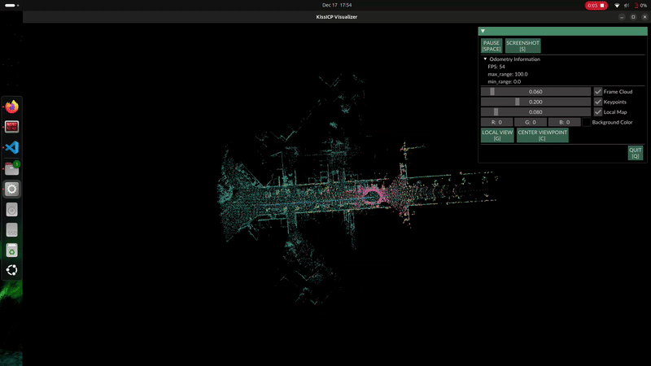
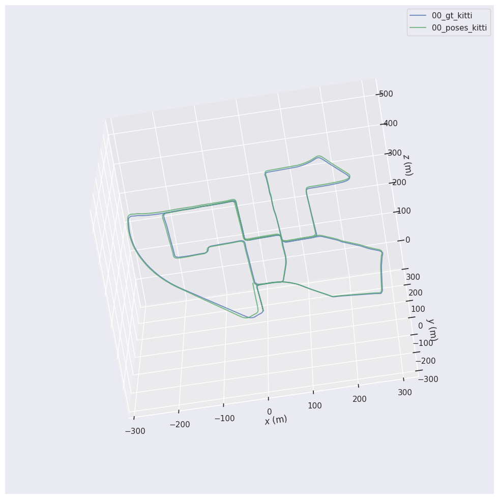
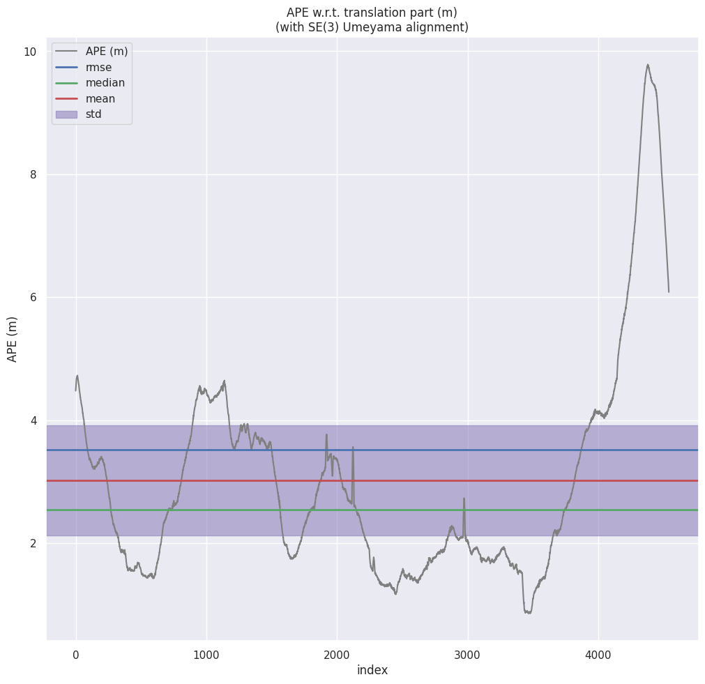
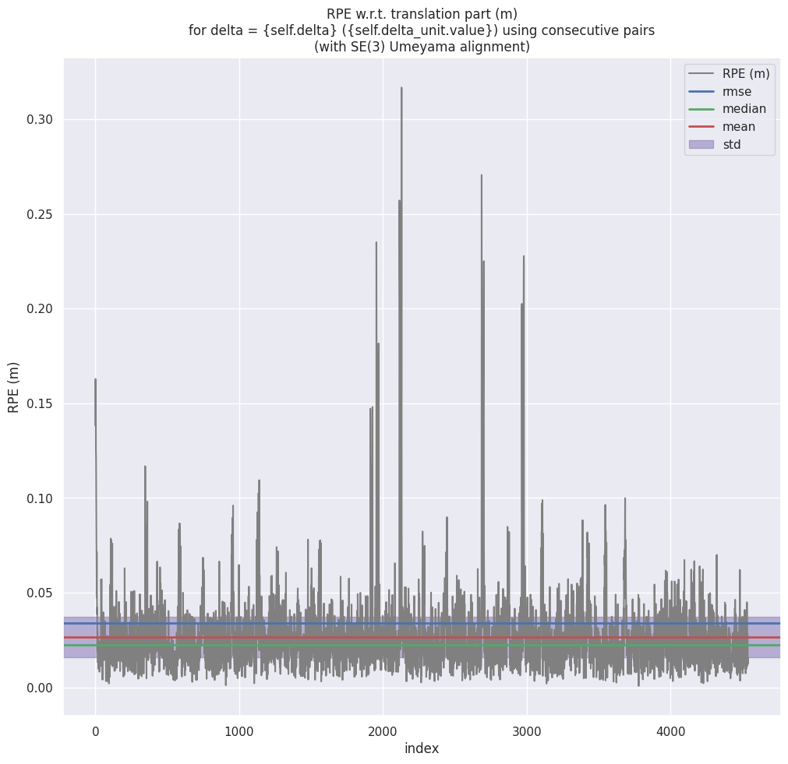

# LiDAR Odometry with KITTI using KISS-ICP



A small pipeline to run KISS-ICP on KITTI odometry sequences and evaluate the results using the EVO toolkit.

This repository contains a convenience script (generate_odometry.py) that:
- Runs the KISS-ICP pipeline on a specified KITTI sequence
- Finds the latest run directory containing generated poses
- Evaluates results with EVO (APE, RPE, trajectory) and saves plots/statistics

## Setup (Conda environment)

This repository includes an environment specification (environment.yml) to create a reproducible Conda environment named `kitti_lo`.

To create the environment:

```bash
conda env create -f environment.yml
```

Activate the environment before running the script:

```bash
conda activate kitti_lo
```

## Repository Structure

```text
kitti-lidar-odometry/
├── README.md
├── environment.yml
├── sequences/
│   └── 00/
│   |   └── velodyne/
|   |   |   └── 000000.bin
|   |   |   └── 000001.bin
|   |   |   └── ...
|   |   └── calib.txt
|   |   └── times.txt
|   └── 01/
|   └── 02/
|   └── ...   
```
## Quick start
1. Place this repository somewhere on your machine and make sure you download the KITTI Odometry data.
2. Copy the sequences folder ito the repository root, and place the calib.txt and poses.txt files inside the respective sequence folders. The repository structure is mentioned above for reference.
3. From the repository root, run the script with a KITTI sequence id (default is 00):

   ```bash
   python generate_odometry.py {SEQ}
   ```

## What the script does
- Calls kiss_icp_pipeline with the specified KITTI sequence and sets an output directory.
- Locates the latest run directory inside `outputs/<SEQ>/` (or the `outputs/<SEQ>/latest` symlink if present).
- Looks for two files inside the run directory:
  - `<SEQ>_gt_kitti.txt` (ground-truth poses in KITTI format)
  - `<SEQ>_poses_kitti.txt` (estimated poses from KISS-ICP, KITTI format)
- Runs EVO commands to compute and save:
  - Absolute Pose Error (APE) plot and stats
  - Relative Pose Error (RPE) plot and stats
  - Trajectory overlay plot and stats
- All EVO outputs are saved in `run_dir/evo_results/`

## Outputs
- `outputs/<SEQ>/<run_dir>/evo_results/ape_<SEQ>.png`
- `outputs/<SEQ>/<run_dir>/evo_results/rpe_<SEQ>.png`
- `outputs/<SEQ>/<run_dir>/evo_results/traj_<SEQ>.png`
- `outputs/<SEQ>/<run_dir>/evo_results/ape_stats.txt`
- `outputs/<SEQ>/<run_dir>/evo_results/rpe_stats.txt`
- `outputs/<SEQ>/<run_dir>/evo_results/traj_stats.txt`

### Trajectory Visualization
The figure below shows the **trajectory overlay** between the estimated odometry (green) and the ground truth (blue).
<p align="center">
  
</p>

### Absolute Pose Error (APE)
APE measures the **global deviation** between the estimated trajectory and the ground truth over time.
<p align="center">
  
</p>

### Relative Pose Error (RPE)
RPE measures the **frame-to-frame motion error**, reflecting local scan registration quality.
<p align="center">
  
</p>

### Results
─────────────────────────── Results for KITTI Odometry Dataset Sequence 00 ───────────────────────────
| Metric                              | Value | Units |
|------------------------------------|:-----:|:-----:|
| Average Translation Error           | 0.527 | %     |
| Average Rotational Error            | 0.002 | deg/m |
| Absolute Trajectory Error (ATE)     | 3.515 | m     |
| Absolute Rotational Error (ARE)     | 0.019 | rad   |
| Average Frequency                   | 58    | Hz    |
| Average Runtime                     | 18    | ms    |


Notes:
- The environment installs dependencies via conda and pip (see environment.yml). The pip section includes `kiss-icp` and `evo` — ensure these packages are available or replace with the appropriate installation method for your system.


## Notes & Troubleshooting
- If `kiss_icp_pipeline` is not in PATH, the script will fail. Make sure you can run `kiss_icp_pipeline` from the shell.
- If EVO commands are missing, install evo (`pip install evo`) and ensure the evo scripts are on your PATH.
- If the script cannot find the GT or estimated pose files, inspect the run directory (printed by the script) to verify file names and contents.
- The script expects KITTI-formatted pose files. If you use a different format, convert to the KITTI pose format first.
- If `kiss_icp_pipeline` is not found, ensure the KISS-ICP binary or entry point is installed and available on your PATH inside the conda environment. You can test by running `conda run -n kitti_lo kiss_icp_pipeline --help`.
- If `evo` commands are missing, install `evo` in the environment (`pip install evo`) or verify the pip-installed scripts are on PATH.

## Contributing
- Feel free to open issues or send pull requests to improve documentation or add features (arg parsing, additional output formats, automated plotting customization).

## License & Credit
- This README and helper script are provided as-is. The KISS-ICP pipeline and EVO are external projects; please refer to their respective repositories and licenses for usage details.

